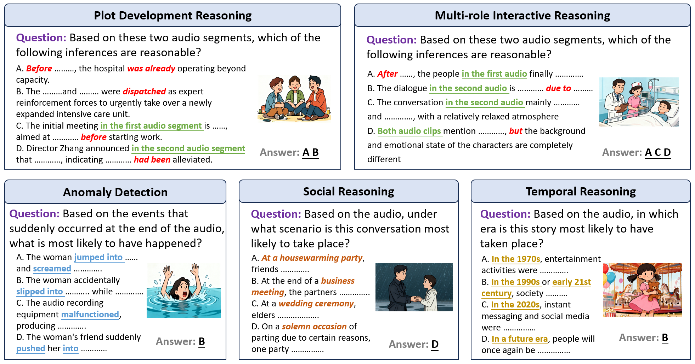

# CMDAR: A Chinese Multi-scene Dynamic Audio Reasoning Benchmark with Diverse Challenges

</div>

<div align="center">
<p align="center">
  🤗<a href="https://huggingface.co/datasets/LLLLuckyer/CMDAR">CMDAR Benchmark</a> |
</p>
</div>


## 🎯Overview
We introduce **CMDAR**, a chinese benchmark for evaluating models on complex, multi-scene, and dynamically evolving audio reasoning tasks. CMDAR comprises 3,000 carefully curated question–answer pairs linked to diverse audio clips, covering five categories of complex reasoning and spanning three question types. We benchmark 26 state-of-the-art audio language models on CMDAR and observe that they exhibit limitations in complex reasoning tasks. In CMDAR-main, Qwen2.5-Omni (open-source) achieves 76.67\% accuracy, whereas GPT-4o Audio (closed-source) reaches 68.47\%. However, GPT-4o Audio substantially outperforms Qwen2.5-Omni on the more challenging multiple-choice with multiple audios and open-ended tasks. And we provide detail analysis corresponding suggestions for the future development of large audio language models (LALMs).
| | Mixed audio | Multiple audio | Open ended | Multi-scene within One audio | Chinese | Instruct following |
| :--- | :---: | :---: | :---: | :---: | :---: | :---: |
| AudioBench | ❌ | ❌ | ✅ | ❌ | ❌ | ❌ |
| AIR-Bench | ❌ | ❌ | ✅ | ❌ | ❌ | ❌ |
| MMAU | ❌ | ❌ | ❌ | ❌ | ❌ | ❌ |
| MMAU-pro | ✅ | ✅ | ✅ | ❌ | ❌ | ✅ |
| MMAR | ✅ | ❌ | ❌ | ❌ | ❌ | ❌ |
| **CMDAR(Ours)** | ✅ | ✅ | ✅ | ✅ | ✅ | ✅ |



## 🏁 Evaluation
In this section, we introduce the evaluation methods for CMDAR. In order to maintain fairness and consistency, we adopt different evaluation methods for different question types.

- for CMDAR-main
```
python ./eval.py --input YOUR_RESULT_JSON 
```
- for CMDAR-multi
```
python ./eval_new.py --input YOUR_RESULT_JSON 
```
- for CMDAR-open
```
python ./score_api.py 
python ./eval.py 
```
## 🤖 Leaderboard

Results on the CMDAR-main benchmark for both audio language models and cascaded models are presented for five task categories.
| Model | Size | Type | SR | ER | SU | AD | TR | Avg(%) |
|-------|------|------|----|----|----|----|----|--------|
| Random guess | — | — | 24.40 | 26.06 | 25.04 | 26.38 | 25.41 | 24.78 |
| Human | — | — | 92.64 | 89.24 | 92.13 | 90.69 | 93.14 | 92.66 |
| **Non-cascaded Model** |
| Qwen2-Audio-Instruct | 7B | LALMs | 38.07 | 31.13 | 23.12 | 35.06 | 27.14 | 33.60 |
| Qwen-Audio-Chat  | 8.4B | LALMs | 17.93 | 20.34 | 10.98 | 15.52 | 22.86 | 17.73 |
| Audio Flamingo 2  | 3B | LALMs | 26.37 | 22.54 | 34.29 | 29.41 | 31.61 | 27.73 |
| Audio Flamingo 3  | 7B | LALMs | 24.00 | 24.28 | 21.43 | 20.83 | 16.67 | 22.20 |
| Audio Flamingo 3 Chat | 7B | LALMs | 15.26 | 16.18 | 12.86 | 13.73 | 20.69 | 15.47 |
| Kimi-Audio-Instruct  | 7B | LALMs | 14.52 | 18.38 | 13.29 | 20.69 | 25.71 | 16.67 |
| Omni-R1  | 7B | OLMs | 44.89 | 45.83 | 45.66 | 60.34 | 38.57 | 46.73 |
| R1-AQA  | 7B | LALMs | 39.11 | 41.18 | 27.17 | 35.06 | 38.57 | 37.80 |
| SALAMONN  | 7B | LALMs | 36.45 | 29.76 | 37.55 | 35.29 | 37.89 | 34.75 |
| Audio-Reasoner  | 8.4B | LALMs | 45.93 | 42.65 | 43.35 | 37.36 | 47.14 | 43.80 |
| DeSTA2.5-Audio | 8B | LALMs | 63.41 | 62.01 | 54.91 | 53.45 | 64.29 | 60.93 |
| MiDashengLM  | 7B | LALMs | 68.44 | 65.69 | 62.43 | **74.71** | 70.00 | 67.80 |
| GPT-4o mini Audio | — | LALMs | 61.19 | 54.34 | 62.86 | 66.67 | 56.90 | 61.47 |
| GPT-4o Audio | — | LALMs | 68.15 | 73.53 | 61.27 | 63.22 | **72.86** | 68.47 |
| Qwen2.5-Omni  | 3B | OLMs | 63.26 | 66.67 | 63.58 | 58.62 | 61.43 | 63.60 |
| Qwen2.5-Omni  | 7B | OLMs | **78.67** | **75.98** | **75.72** | 73.56 | 71.43 | **76.67** |
| **Cascaded Model** |
| GPT-4o Audio + Qwen2.5-Omni | 7B | — | 56.59 | 53.68 | 50.87 | 55.75 | 54.29 | 54.93 |
| GPT-4o Audio + Qwen2-Audio-Instruct | 7B | LALMs | 33.19 | 24.51 | 21.39 | 28.74 | 37.14 | 29.13 |
| GPT-4o Audio + Llama-3-Ins. | 8B | LLMs | 55.70 | 48.77 | 46.82 | 60.92 | 58.57 | 53.53 |
| GPT-4o Audio + DeepSeek-V3 | — | LLMs | **82.52** | **76.88** | **87.14** | **82.84** | **82.18** | **82.13** |
| GPT-4o Audio + DeepSeek-R1 | — | LLMs | 46.52 | 39.31 | 34.29 | 41.42 | 43.10 | 43.33 |
| Qwen2-Audio-Instruct + Llama-3-Instruct | 8B | LLMs | 54.62 | 45.41 | 54.74 | 54.43 | 57.98 | 53.93 |
| Qwen2-Audio-Instruct + GPT-4o Audio | — | LALMs | 59.41 | 49.71 | 68.57 | 60.29 | 65.52 | 59.67 |
| Qwen2-Audio-Instruct + DeepSeek-R1 | — | LLMs | 42.52 | 39.95 | 30.64 | 37.36 | 34.29 | 39.47 |
| Qwen2-Audio-Instruct + Qwen2.5-Omni | 7B | — | 49.04 | 46.57 | 40.46 | 48.28 | 45.71 | 47.13 |
| Qwen2-Audio-Instruct + DeepSeek-V3 | — | LLMs | 76.44 | 74.29 | 76.44 | 77.01 | 67.63 | 74.80 |

## To-Do List
- [x] Release the CMDAR paper.
- [x] Release the Benchmark and Code of Evalution.
- [x] Release the Source Audios.
- [x] Release the Complete README.

